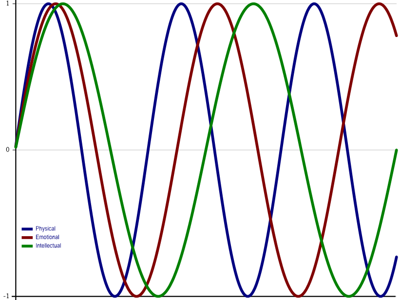

<div id="P1_Elimination_Sort" class="problem" markdown="1">     

## 1: Elimination Sort

<p>An "Elimination Sort" is a somewhat farcical sorting algorithm which starts with the leftmost element and keeps subsequent elements that are at least as large as the previous kept element, discarding all other elements. For example:</p>
<style>
.h {background-color: #eceff4; #2e3440: ;}
</style>
<pre class="APL">EliminationSort <span class="h">1</span> <span class="h">3</span> <span class="h">7</span> 3 5 <span class="h">8</span> 5 <span class="h">8</span> 1 6 1 <span class="h">8</span> 1 <span class="h">10</span> 8 4 3 4 1 4
1 3 7 8 8 8 10 
</pre>
<p>Write a function that:</p>
<ul>
    <li>takes a non-empty numeric vector right argument</li>
    <li>returns an "Elimination-sorted" vector of the right argument</li>
    </ul>
<p><i class="fas fa-lightbulb-on"></i> <strong>Hint:</strong> The <em>progressive-maxima</em> idiomatic phrase <a href="https://aplcart.info?q=progressive%20maxima" class="APL" target="_blank">⌈\</a>, the <em>greater or equal</em> function <a class="APL" href="https://help.dyalog.com/latest/#Language/Primitive%20Functions/Greater%20Or%20Equal.htm" target="_blank">≥</a>, and the <em>replicate</em> function <a class="APL" href="https://help.dyalog.com/latest/#Language/Primitive%20Functions/Replicate.htm" target="_blank">/</a> could be helpful in solving this problem.</p>
<hr />
<h5>Examples</h5>
<pre class="APL">
      (<i>your_function</i>) ⍳10
1 2 3 4 5 6 7 8 9 10

      (<i>your_function</i>) 2 1 4 3 6 5 8 7 10 9
2 4 6 8 10

      (<i>your_function</i>) 1000 2500 1333 1969 3141 2345 3141 4291.9 4291.8 4292
1000 2500 3141 3141 4291.9 4292

      EliminationSort 1 3 7 3 5 8 5 8 1 6 1 8 1 10 8 4 3 4 1 4
1 3 7 8 8 8 10 
</pre>

</div>

<div id="P2_Put_It_In_Reverse" class="problem" markdown="1">     

## 2: Put It In Reverse

<p>The <em>find</em> function <a href="https://help.dyalog.com/latest/#Language/Primitive%20Functions/Find.htm" class="APL" target="_blank">X⍷Y</a> identifies the beginnings of occurrences of array <span class="APL">X</span> in array <span class="APL">Y</span>.</p>
<p>In this problem, you're asked to return a result that identifies the endings of occurrences of array <span class="APL">X</span> in array <span class="APL">Y</span>. To keep things simple, <span class="APL">X</span> and <span class="APL">Y</span> will be at most rank 1, meaning they'll either be vectors or scalars.</p>
<p>Write a function that:</p>
<ul>
    <li>takes a scalar or vector left argument</li>
    <li>takes a scalar or vector right argument</li>
    <li>returns a Boolean result that is the same shape as the right argument where 1's mark the ends of occurrences of the left argument in the right argument</li>
</ul>
<p><i class="fas fa-lightbulb-on"></i> <strong>Hint:</strong> The <em>find</em> function <a href="https://help.dyalog.com/latest/#Language/Primitive%20Functions/Find.htm" class="APL" target="_blank">⍷</a> and <em>reverse</em> function <a href="https://help.dyalog.com/latest/#Language/Primitive%20Functions/Reverse.htm" class="APL" target="_blank">⌽</a> could be helpful in solving this problem.</p>
<hr />
<h5>Examples</h5>
<pre class="APL">
      'abra' (<i>your_function</i>) 'abracadabra'
0 0 0 1 0 0 0 0 0 0 1

      'issi' (<i>your_function</i>) 'Mississippi'
0 0 0 0 1 0 0 1 0 0 0

      'bb' (<i>your_function</i>) 'bbb bbb'
0 1 1 0 0 1 1
</pre><pre class="APL">
      (,42) (<i>your_function</i>) 42
0

      42 (<i>your_function</i>) 42
1

      (,42) (<i>your_function</i>) ,42
1
</pre><pre class="APL">
      'are' 'aquatic' (<i>your_function</i>) 'ducks' 'are' 'aquatic' 'avians' 
0 0 1 0
</pre>

</div>

<div id="P3_Caesar_Salad" class="problem" markdown="1">     

## 3: Caesar Salad

<p>A Caesar cipher, also known as a shift cipher, is one of the simplest encryption techniques. In a Caesar cipher, each letter in the plaintext is replaced by a letter some fixed number of positions away in the alphabet, effectively "shifting" the alphabet.</p>
<p>Write a function that:</p>
<ul>
    <li>takes a single integer left argument representing the size of the shift</li>
    <li>takes a character vector right argument representing the plaintext message</li> 
    <li>returns a result with the same shape as the right argument representing the encrypted message</li>
</ul>
<p><strong>Notes:</strong><ul>
  <li>Use <span class="APL">' ',⎕A</span> as the alphabet</li>
  <li>You can assume that the plaintext message will contain only characters found in the alphabet.</li>
  </ul></p>
<p><i class="fas fa-lightbulb-on"></i> <strong>Hint:</strong> The <em>rotate</em> function <a href="https://help.dyalog.com/latest/Content/Language/Primitive%20Functions/Rotate.htm" class="APL" target="_blank">⌽</a> could be helpful in solving this problem.</p>
<hr />
<h5>Examples</h5>
<pre class="APL">
      4 (<i>your_function</i>) 'HELLO WORLDS'
LIPPSD SVPHW
    
      ¯4 (<i>your_function</i>) 'HELLO WORLDS' ⍝ negative shifts are okay
DAHHKWSKNH O 

      0 (<i>your_function</i>) 'HELLO WORLDS' ⍝ no shift is okay
HELLO WORLDS

      27 (<i>your_function</i>) 'HELLO WORLDS'
HELLO WORLDS

      ¯10 (<i>your_function</i>) '' ⍝ returns an empty vector
    
    </pre>

</div>

<div id="P4_Like_a_Version" class="problem" markdown="1">     

## 4: Like a Version

<p>One common software version numbering scheme is known as "semantic versioning". Typically, semantic versioning uses three numbers representing a major version number, a minor version number, and a build number.</p>
<ul><li>The major version is incremented when a new version of the software introduces changes that would make existing applications using the software fail or behave differently.</li><li>The minor version is incremented when new features are added that didn't previously exist — no pre-existing use of the software will fail in this case.</li><li>The build number is incremented for bug fixes and similar changes.</li></ul>

<p>Write a function that:</p>
<ul>
<li>takes 3-element integer vector left and right arguments each representing a major version, minor version, and build number.</li>
<li>returns<ul>
  <li><code class="APL">¯1</code> if the left argument represents a version number older than the right argument</li>
  <li><code class="APL">&nbsp;0</code> if the left argument represents a version number equal to the right argument</li>
  <li><code class="APL">&nbsp;1</code> if the left argument represents a version number newer than the right argument</li>
  </ul>
</li>
</ul>
<p><i class="fas fa-lightbulb-on"></i> <strong>Hint:</strong> The <em>less</em> function <a href="https://help.dyalog.com/latest/#Language/Primitive%20Functions/Less.htm" class="APL" target="_blank">&lt;</a> could be helpful in solving this problem.</p>
<hr />
<h5>Examples</h5>
<pre class="APL">      
      1 2 3 (<i>your_function</i>) 1 2 3
0 

      1 2 3 (<i>your_function</i>) 1 0 9
1

      14 2 11 (<i>your_function</i>) 14 2 12
¯1
</pre>

</div>

<div id="P5_Risky_Business" class="problem" markdown="1">     

## 5: Risky Business

<p>The board game <a href="https://en.wikipedia.org/wiki/Risk_(game)">Risk</a> is a game of world domination where opposing players roll dice to determine the outcome of one player's armies attacking another's. The attacker can roll up to three 6-sided dice and the defender can roll up to two 6-sided dice. The resulting rolls are then individually compared from highest to lowest. If the attacker's die value is greater than the defender's, the defender loses one army. If the defender's die value is greater than or equal to the attacker's, the attacker loses one army. If one player rolls more dice than the other other player, the additional dice are not considered in the evaluation. For this problem, we'll generalize the task by allowing any number of dice for either the attacker or defender, and any integer values in the arguments.</p>
<p>Write a function that:</p>
<ul>
<li>takes a non-empty, descending integer vector left argument representing the attacker's dice rolls</li>
<li>takes a non-empty, descending integer vector right argument representing the defender's dice rolls</li>
<li>returns a 2-element vector where the first element represents the number of armies the attacker lost and the second element represents the number of armies the defender lost.</li>
</ul>
<p><strong>Note:</strong> The left and right arguments do not need to be the same length.</p>
<p><i class="fas fa-lightbulb-on"></i> <strong>Hint:</strong> The <em>less</em> function <a href="https://help.dyalog.com/latest/#Language/Primitive%20Functions/Less.htm" class="APL" target="_blank">&lt;</a> could be helpful in solving this problem.</p>
<hr>
<h5>Examples</h5>
<pre class="APL">      
      6 6 4 2 1 (<i>your_function</i>) 6 5 5 ⍝ attacker loses 2 armies, defender loses 1 army
2 1 

      6 (<i>your_function</i>)⍥, 5 ⍝ ⍥, ravels both arguments (making them vectors) before passing them to your function
0 1

      4 0 ¯1  (<i>your_function</i>) 3 1 ¯2
1 2
</pre>

</div>

<div id="P6_Key_Value_Pairs" class="problem" markdown="1">     

## 6: Key/Value Pairs

<p>Representing data as key/value pairs (also known as name/value pairs) is a very common technique. For example, it can be found in query strings in HTTP URIs, attribute settings in HTML elements, and in JSON objects. One common representation for a key/value pair is to have a character key (name) followed by an equals sign (=) followed by the value. Multiple key/value pairs can be separated by a delimiter character or characters. For example:</p>
<pre class="APL">
      key1=value1;key2=value2
</pre>
 
<p>Write a function that:</p>
<ul>
  <li>takes a 2-element character vector left argument where the first element represents the separator character between multiple key/value pairs and the second element represents the separator between the key and the value for each pair.</li>
  <li>takes a character vector right argument representing a valid set of key/value pairs (delimited as specified by the left argument).</li>
  <li>returns a 2-column matrix where the first column contains the character vector keys of the key/value pairs and the second column contains the character vector values.</li>
</ul>
<p><strong>Note:</strong> You may assume that there will be no empty names or values in the right argument.</p> 
<p><i class="fas fa-lightbulb-on"></i> <strong>Hint:</strong> The <em>partition</em> function <a href="https://help.dyalog.com/latest/#Language/Primitive%20Functions/Partition.htm" class="APL" target="_blank">⊆</a> could be helpful in solving this problem.</p>
<hr>
<h5>Examples</h5>
<pre class="APL">      
      ⍴ ⎕← ' ='(<i>your_function</i>)'language=APL dialect=Dyalog' 
┌────────┬──────┐
│language│APL   │
├────────┼──────┤
│dialect │Dyalog│
└────────┴──────┘
2 2      

      ⍴ ⎕← ';:'(<i>your_function</i>)'duck:donald' 
┌────┬──────┐
│duck│donald│
└────┴──────┘
1 2      
 
      ⍴ ⎕← '/:'(<i>your_function</i>)'name:Morten/name:Brian/name:Adám'
┌────┬──────┐
│name│Morten│
├────┼──────┤
│name│Brian │
├────┼──────┤
│name│Adám  │
└────┴──────┘
3 2
</pre>

</div>

<div id="P7_Lets_Be_Rational" class="problem" markdown="1">     

## 7: Let's Be Rational

<p>A rational number is a number that can be expressed as the quotient of 2 integers <span class="APL">p÷q</span> — a numerator <span class="APL">p</span> and a denominator <span class="APL">q</span>. For example, for <span class="APL">1.5</span>, <span class="APL">p</span> and <span class="APL">q</span> would be <span class="APL">3</span> and <span class="APL">2</span>, respectively.</p>
<p>Write a function that:</p>
<ul>
  <li>takes a single non-zero positive number right argument.</li>
  <li>returns a 2-element "integer" result representing the smallest non-zero positive values for <span class="APL">p</span> and <span class="APL">q</span> respectively</li>
</ul>
<p><strong>Notes:</strong></p>
<ul>
<li>We use "integer" in the result description because the result might contain a number larger than can be represented as an integer data type in Dyalog APL. For example, the result when applying the function to <span class="APL">⌊/⍬</span> would be <span class="APL">1.797693135E308 1</span> which is represented as a 64-bit floating point array.</li>
<li>The test for the correctness of your solution will be that, given<br /><span class="APL">r ← (<i>your_function</i>) a</span><br/>your solution should satisfy both the following:<ul>
  <li><span class="APL">r ≡ ⌊0.5+r</span></li>
  <li><span class="APL">a = ÷/r</span></li></ul></li>
</ul>
<p><i class="fas fa-lightbulb-on"></i> <strong>Hint:</strong> The <em>Lowest Common Multiple</em> function <a href="http://help.dyalog.com/latest/#Language/Primitive%20Functions/And%20Lowest%20Common%20Multiple.htm" class="APL" target="_blank">∧</a> or <em>Greatest Common Divisor</em> function <a href="http://help.dyalog.com/latest/#Language/Primitive%20Functions/Or%20Greatest%20Common%20Divisor.htm" class="APL" target="_blank">∨</a> could be helpful in solving this problem.</p>
<hr />
<h5>Examples</h5>
<pre class="APL">
      (<i>your_function</i>) 1.2
6 5      

      (<i>your_function</i>) 3.5
7 2

      (<i>your_function</i>) ÷3
1 3
</pre>

</div>

<div id="P8_Critical_Thinking" class="problem" markdown="1">     

## 8: Critical Thinking



The biorhythm theory is a pseudo-scientific idea that one's life is affected by three rhythmic cycles beginning from one's date of birth. The cycles are: 

- The Physical cycle, with a periodicity of **23** days, affecting co-ordination, strength, and general well-being
- The Emotional cycle, with a periodicity of **28** days, affecting creativity, sensitivity, mood, perception, and awareness
- The Intellectual cycle, with a periodicity of **33** days, affecting alertness, analytical functioning, logical analysis, memory, and communication

"Critical days" are days when a cycle crosses the x-axis in either direction and are purported to be accompanied by unstable conditions in the corresponding area. A "double critical day" occurs when two of the three cycles cross the x-axis on the same day. Starting from one's birthdate, double critical days occur on multiples of the least common multiple of the half of the periodicities of the two involved cycles. Thus Physical-Emotional, Physical-Intellectual and Emotional-Intellectual double critical days can be calculated respectively using multiples of: 

```APL
      23 23 28∧⍥(÷∘2)28 33 33
322 379.5 462
```

Fortunately, the dreaded "triple critical day", when all three cycles cross the x-axis on the same day, only occurs every `(∧/23 28 33÷2)` or 10,626 days (a bit more than 29 years).

Write a function that:

- takes a 3-element integer left argument representing a valid birthdate
- takes a 3-element integer right argument representing a valid date occurring on or after the left argument
- returns a 3-element integer array representing the date of the next double or triple critical day occurring on or after the date represented by the right argument.

**Note:** All the dates in this specification are to be in the form <span class="APL">year month day</span>

<strong>Hint:</strong> The <em>date time system function</em> <a
            href="https://help.dyalog.com/latest/#Language/System%20Functions/dt.htm"
            class="APL" target="_blank">⎕DT</a> and <em>residue function</em> <a
            href="https://help.dyalog.com/latest/#Language/Primitive%20Functions/Residue.htm"
            class="APL" target="_blank">|</a> could be helpful in solving this problem.
<hr />

##### Examples

```APL
      1962 10 31 (your_function) 2023 1 1
2023 2 4 

      1961 2 23 (your_function) 1961 2 23 ⍝ one's birthdate is a triple critical day
1961 2 23
```

</div>

<div id="P9_Flipping_Pairs" class="problem" markdown="1">     

## 9: Flipping Pairs

This problem has no practical use in the real world (that the author can think of) other than to give your array manipulation muscles some exercise.

Write a function that:

- takes a non-empty non-scalar array right argument
- returns an array of the same shape as the argument, but with pairs of elements along the last axis "flipped". If the array has an odd number of elements in the last axis, leave the last element unchanged.

<strong>Hint:</strong> Either the <em>reverse</em> function <a href="https://help.dyalog.com/latest/#Language/Primitive%20Functions/Reverse.htm" class="APL" target="_blank">⌽</a> used with the <em>partitioned enclose</em> function <a href="https://help.dyalog.com/latest/#Language/Primitive%20Functions/Partitioned%20Enclose.htm" class="APL" target="_blank">⊂</a>, or the <em>grade up</em> function <a class="APL" target="_blank" href="https://help.dyalog.com/latest/#Language/Primitive%20Functions/Grade%20Up%20Monadic.htm">⍋</a> used with the <em>index</em> function <a class="APL" target="_blank" href="https://help.dyalog.com/latest/#Language/Primitive%20Functions/Index.htm">⌷</a>, could be helpful in solving this problem.
<hr />
<h5>Examples</h5>
<pre class="APL">
      (<i>your_function</i>) ⍳10
2 1 4 3 6 5 8 7 10 9

      (<i>your_function</i>) ⍳9
2 1 4 3 6 5 8 7 9

      (<i>your_function</i>) 4 2⍴⍳8
2 1
4 3
6 5
8 7

(<i>your_function</i>) 4 3⍴⍳12
 2  1  3
 5  4  6
 8  7  9
11 10 12

      (<i>your_function</i>) 3 3 3⍴⍳27
2  1  3
5  4  6
8  7  9
     
11 10 12
14 13 15
17 16 18
     
20 19 21
23 22 24
26 25 27

      (<i>your_function</i>) 2 3⍴'donald' 'duck' 'wrote' 'some' 'good' 'APL'
┌────┬──────┬─────┐
│duck│donald│wrote│
├────┼──────┼─────┤
│good│some  │APL  │
└────┴──────┴─────┘
</pre>

</div>

<div id="P10_Partition_with_a_Twist" class="problem" markdown="1">     

## 10: Partition with a Twist

<p>Splitting delimited data into sub-arrays using partitioning on a delimiter character (or characters) is a fairly common operation in APL. For instance, if you partition the character vector <span class="APL">'this is an example'</span> on each occurrence of the space character, there would be 4 sub-arrays: <span class="APL">'this' 'is' 'an' 'example'</span>. This problem adds a slight twist to the operation in that the left argument indicates how many sub-arrays to return.</p>
<p>Write a function that:</p>

- takes a non-negative integer left argument, <strong>N</strong>
- takes a space-delimited character vector right argument, <strong>string</strong>
- returns an array of length <strong>N</strong> where:
    - if <strong>N</strong> is less than or equal to the number of sub-arrays in <strong>string</strong>, the first <strong>N-1</strong> elements of the result are the first <strong>N-1</strong> space-delimited partitions in <strong>string</strong>.<br/> The <strong>N</strong><sup>th</sup> element of the result is the remaining portion of <strong>string</strong>.
    - if <strong>N</strong> is greater than the number of sub-arrays, pad the result with as many empty arrays as necessary to achieve length <strong>N</strong>.

<p><strong>Note: </strong>Each space in <strong>string</strong> be considered as a delimiter. This means that leading, trailing, or contiguous spaces are potentially significant.</p>
<p><i class="fas fa-lightbulb-on"></i> <strong>Hint:</strong> The <em>partitioned enclose</em> function <a href="https://help.dyalog.com/latest/Content/Language/Primitive%20Functions/Partitioned%20Enclose.htm" class="APL" target="_blank">⊂</a> could be helpful in solving this problem.</p>
<hr />
<h5>Examples</h5>
<pre class="APL">
      1 (<i>your_function</i>) 'this is a sample'
┌────────────────┐
│this is a sample│
└────────────────┘

      2 (<i>your_function</i>) 'this is a sample'
┌────┬───────────┐
│this│is a sample│
└────┴───────────┘

      4 (<i>your_function</i>) 'this is a sample'
┌────┬──┬─┬──────┐
│this│is│a│sample│
└────┴──┴─┴──────┘

      ⍴¨4 (<i>your_function</i>) 'this is a sample' ⍝ each sub-array is a vector
┌─┬─┬─┬─┐
│4│2│1│6│
└─┴─┴─┴─┘

      13 (<i>your_function</i>) '  this  is  a sample  ' ⍝ note the leading, trailing, and multiple interior spaces 
┌┬┬────┬┬──┬┬─┬──────┬┬┬┬┬┐
│││this││is││a│sample││││││
└┴┴────┴┴──┴┴─┴──────┴┴┴┴┴┘

      0 (<i>your_function</i>) 'this is a sample' ⍝ returns an empty vector


      4 (<i>your_function</i>) ''
┌┬┬┬┐
│││││
└┴┴┴┘
</pre>

</div>

